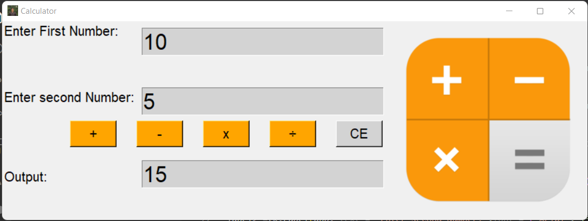
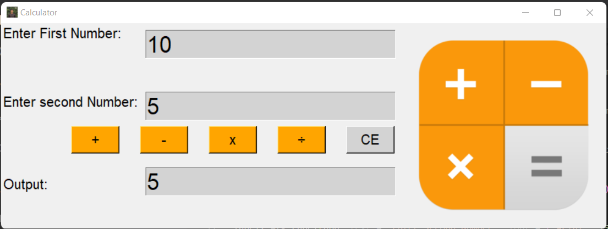
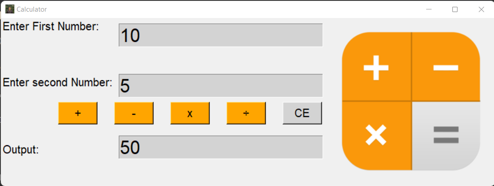

<div align="center">
  <h1 align="center"> basic-calculator</h1>
</div>

## About basic-calculator:
This is a basic-calculator Application made in Python using Tkinter library.

## Screen Shots:
<div align="center">
  
</div>
<div align="center">
  
</div>
<div align="center">
  
</div>
<div align="center">
  
</div>
<div align="center">
  
</div>


### Steps to Run on Local Machine

***

#### Note: You need to have Python installed in your Local Machine if not, first install it from <a href="https://www.python.org/downloads/windows/">here</a>.
##### Step 1) Clone jontybhalodiya/basic-calculator.
##### Step 2) Open basic-calculator Cloned Directory in Command Prompt.
##### Step 3) Run the Following commands to install necessary Libraries:
```
pip install tkinter
```
##### Step 4) Open basic_calculator.py in Visual Studio code and Click Run.

***
